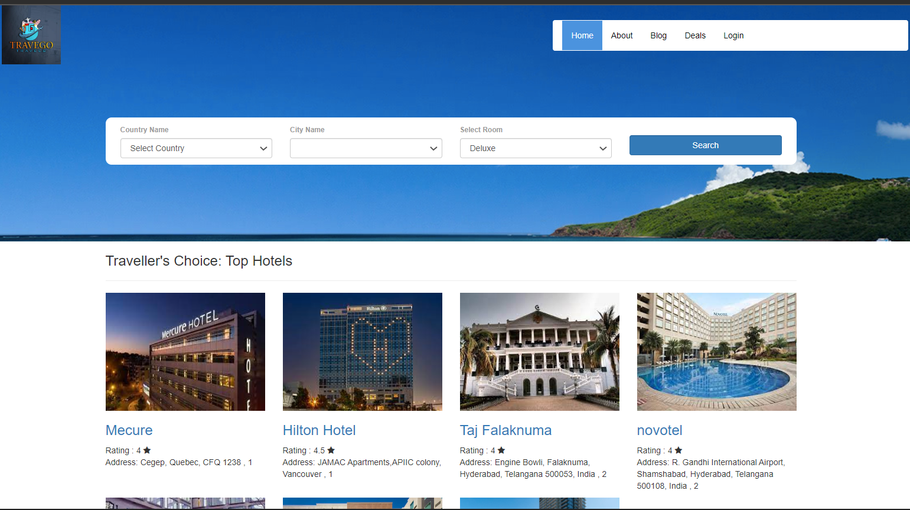

 Created a hotel booking website with Frontend: HTML, CSS, bootstrap, javascript, Backend: PHP, MySQL. The hotel booking application contains multiple pages like home, user sign, hotel booking, blog page, checkout page, and admin panel. Php is used to authenticate(register/sign-in) to the application. Once authenticated, users can see the available hotels, check their prices and reserve the hotel rooms. The admin can manage the hotel services.
\item In this project, I have Designed and implemented automation scripts using Selenium IDE and Selenium Webdriver. Written test cases and test plans, executed test scripts, and reporting defects.Reviewed test plans and procedures to ensure system requirements were met.Used JIRA Software Testing tools to manage project tasks and bugs effectively across teams.
